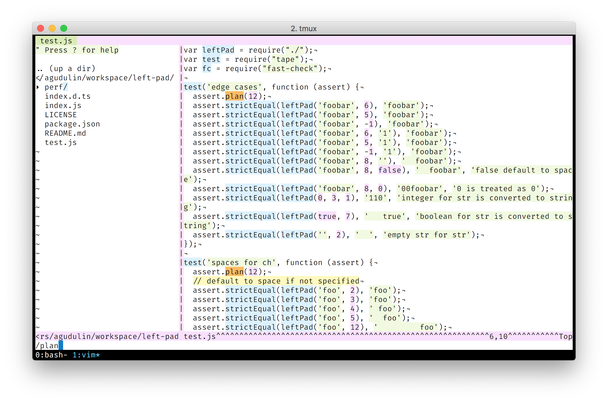

# Alabaster Color Scheme

A light color scheme with minimal amount of highlighting for vim.

## Screenshots



## Installation

1. Modify iterm colors

```
CMD+I → Colors → Color Presets → Import... (select alabaster.itermcolors)
```

2. Copy `alabaster.vim` into `~/.vim/colors/`

3. Modify .vimrc

```
colorscheme alabaster
```

## Notes

Based on Alabaster BG theme by Nikita Prokopov https://github.com/tonsky/sublime-scheme-alabaster/